# CLAUDE.md - Instruksi untuk Claude Code | Instructions for Claude Code

<p align="center">
  
  
</p>

---

## 📋 Daftar Isi | Table of Contents

- [Overview Proyek | Project Overview](#-overview-proyek--project-overview)
- [Ringkasan Arsitektur | Architecture Summary](#-ringkasan-arsitektur--architecture-summary)
- [Tech Stack](#-tech-stack)
- [Struktur Proyek | Project Structure](#-struktur-proyek--project-structure)
- [Konsep Penting | Key Concepts](#-konsep-penting--key-concepts)
- [Panduan Coding | Coding Guidelines](#-panduan-coding--coding-guidelines)
- [Perintah Umum | Common Commands](#-perintah-umum--common-commands)
- [File Penting | Important Files](#-file-penting--important-files)
- [Skema Database | Database Schema](#-skema-database--database-schema)
- [Environment Variables](#-environment-variables)
- [Panduan Testing | Testing Guidelines](#-panduan-testing--testing-guidelines)
- [Catatan Deployment | Deployment Notes](#-catatan-deployment--deployment-notes)
- [Referensi | References](#-referensi--references)

---

## 📖 Overview Proyek | Project Overview

**SURGE-WSI** (Weekly Swing Intelligence) adalah sistem trading algoritmik yang menggabungkan Quantitative Analysis dengan ICT/SMC Concepts untuk trading forex di MT5 (Finex Indonesia).

> **SURGE-WSI** (Weekly Swing Intelligence) is an algorithmic trading system combining Quantitative Analysis with ICT/SMC Concepts for forex trading on MT5 (Finex Indonesia).

---

## 🏗 Ringkasan Arsitektur | Architecture Summary

```mermaid
flowchart TB
    subgraph L1["📥 Layer 1: Data Pipeline"]
        MT5[MT5 Finex] --> DB[(TimescaleDB)]
        DB --> Cache[(Redis)]
        Cache --> KF[Kalman Filter]
    end

    subgraph L2["⏰ Layer 2: Regime + Time"]
        KF --> WHEN{WHEN to Trade}
        WHEN --> KZ[Kill Zone Check]
        WHEN --> HMM[HMM Regime]
    end

    subgraph L3["🎯 Layer 3: POI Detection"]
        HMM --> WHERE{WHERE to Trade}
        WHERE --> OB[Order Blocks]
        WHERE --> FVG[Fair Value Gaps]
    end

    subgraph L4["🔔 Layer 4: Entry Trigger"]
        OB --> HOW{HOW to Enter}
        FVG --> HOW
        HOW --> RC[Rejection Candle]
    end

    subgraph L5["💰 Layer 5: Risk Management"]
        RC --> HOWMUCH{HOW MUCH}
        HOWMUCH --> PS[Position Sizing]
        HOWMUCH --> SLTP[SL/TP Setup]
    end

    subgraph L6["🚪 Layer 6: Smart Exit"]
        SLTP --> EXIT{WHEN to Exit}
        EXIT --> PTP[Partial TP]
        EXIT --> RF[Regime Flip]
        EXIT --> FC[Friday Close]
    end
```



### 6 Layer Inti | 6 Core Layers

| # | Layer | Input | Output |
|---|-------|-------|--------|
| 1️⃣ | **Data Pipeline** | Raw price dari MT5 | Smoothed price, velocity, acceleration |
| 2️⃣ | **Regime + Time** | Kalman data | trade_bias (BUY/SELL/SKIP) |
| 3️⃣ | **POI Detection** | Trade bias | List of POIs with scores |
| 4️⃣ | **Entry Trigger** | POI zones | trigger_confirmed (bool) |
| 5️⃣ | **Risk Management** | Confirmed trigger | lot_size, SL, TP[] |
| 6️⃣ | **Smart Exit** | Open positions | exit_action |

---

## 🛠 Tech Stack

| Komponen | Teknologi | Versi | Link |
|----------|-----------|-------|------|
| 🖥️ **Broker** | Finex Indonesia (MT5) | - | [finex.co.id](https://finex.co.id) |
| 🐍 **Language** | Python | 3.11+ | [python.org](https://python.org) |
| 🗄️ **Database** | TimescaleDB | 2.x | [timescale.com](https://timescale.com) |
| ⚡ **Cache** | Redis | 7.x | [redis.io](https://redis.io) |
| 📈 **Kalman** | filterpy | 1.4+ | [filterpy docs](https://filterpy.readthedocs.io) |
| 🧠 **HMM** | hmmlearn | 0.3+ | [hmmlearn docs](https://hmmlearn.readthedocs.io) |
| 💹 **SMC** | smartmoneyconcepts | 0.0.26 | [GitHub](https://github.com/joshyattridge/smart-money-concepts) |
| 📊 **MT5 API** | MetaTrader5 | 5.0+ | [MQL5 Docs](https://www.mql5.com/en/docs/python_metatrader5) |

---

## 📁 Struktur Proyek | Project Structure

```
SURGE-WSI/
│
├── 📄 README.md              # Dokumentasi utama | Main documentation
├── 📄 CLAUDE.md              # File ini | This file
├── 📄 WORKFLOW.md            # Workflow detail | Detailed workflow
├── 📄 requirements.txt       # Python dependencies
├── 📄 .env.example           # Template environment variables
│
├── 📁 config/
│   └── settings.yaml         # Konfigurasi sistem | System configuration
│
├── 📁 src/
│   ├── 📁 data/              # Data pipeline
│   │   ├── mt5_connector.py  # Koneksi MT5 | MT5 connection
│   │   ├── db_handler.py     # Database operations
│   │   └── cache.py          # Redis cache
│   │
│   ├── 📁 analysis/          # Modul analisis | Analysis modules
│   │   ├── kalman_filter.py  # Kalman noise reduction
│   │   ├── regime_detector.py # HMM regime detection
│   │   └── poi_detector.py   # Order Block & FVG
│   │
│   ├── 📁 trading/           # Trading logic
│   │   ├── entry_trigger.py  # Entry trigger detection
│   │   ├── risk_manager.py   # Position sizing
│   │   ├── exit_manager.py   # Exit management
│   │   └── executor.py       # Main trading loop
│   │
│   └── 📁 utils/             # Utilities
│       ├── killzone.py       # Session time checker
│       ├── logger.py         # Logging setup
│       └── telegram.py       # Telegram notifications
│
├── 📁 tests/                 # Unit tests
├── 📁 backtest/              # Backtesting scripts
└── 📁 docs/                  # Dokumentasi tambahan | Additional docs
```

---

## 🎯 Konsep Penting | Key Concepts

### 1. ⏰ Kill Zones (Jam Trading - UTC | Trading Hours - UTC)

```mermaid
gantt
    title Kill Zones (UTC)
    dateFormat HH:mm
    axisFormat %H:%M

    section Sessions
    London Session       :london, 07:00, 3h
    New York Session     :newyork, 12:00, 3h
    Overlap (BEST)       :crit, overlap, 12:00, 4h

    section No Trade
    Friday Close Risk    :done, friday, 18:00, 6h
```



| Sesi | Waktu UTC | WIB | Keterangan |
|------|-----------|-----|------------|
| 🇬🇧 **London** | 07:00 - 10:00 | 14:00 - 17:00 | High volatility |
| 🇺🇸 **New York** | 12:00 - 15:00 | 19:00 - 22:00 | High volatility |
| 🔥 **Overlap** | 12:00 - 16:00 | 19:00 - 23:00 | Best opportunity |
| 🚫 **No Trade** | Luar sesi | - | Skip trading |

### 2. 🧠 HMM Regime States

| State | Kondisi | Aksi |
|-------|---------|------|
| 🟢 **BULLISH** | velocity > 0, confidence > 60% | Look for BUY setups |
| 🔴 **BEARISH** | velocity < 0, confidence > 60% | Look for SELL setups |
| ⚪ **SIDEWAYS** | \|velocity\| < threshold | NO TRADE |

### 3. 🎯 POI (Point of Interest) Types

| Tipe | Deskripsi | Prioritas |
|------|-----------|-----------|
| 📦 **Order Block** | Candle terakhir berlawanan sebelum impulse move | Primary |
| 📐 **Fair Value Gap** | Price imbalance / gap | Confluence |

### 4. 🔔 Entry Trigger

| Kondisi | Nilai |
|---------|-------|
| Rejection candle | wick > 50% dari total range |
| Posisi | Di valid POI zone |
| Alignment | Sesuai regime direction |

### 5. 💰 Risk Management Rules

| Parameter | Nilai |
|-----------|-------|
| Base risk | 1% per trade |
| High quality POI | 1.5% |
| Low quality (M15) | 0.5% |
| Max SL H4/H1 | 50/40 pips |
| Max SL M15 | 30 pips |
| Max positions | 3 |
| Max daily risk | 3% |

---

## 📝 Panduan Coding | Coding Guidelines

| # | Guideline | Deskripsi |
|---|-----------|-----------|
| 1 | **Python Style** | Follow PEP 8, gunakan type hints |
| 2 | **Logging** | Gunakan loguru untuk semua logging |
| 3 | **Error Handling** | Selalu handle exceptions gracefully |
| 4 | **Config** | Gunakan YAML untuk konfigurasi, jangan hardcode |
| 5 | **Secrets** | Gunakan environment variables untuk API keys |

### Contoh Type Hints | Type Hints Example

```python
from typing import List, Dict, Optional
from dataclasses import dataclass

@dataclass
class POI:
    poi_type: str
    direction: str
    zone_high: float
    zone_low: float
    quality_score: float

def find_pois(
    candles: List[dict],
    timeframe: str
) -> List[POI]:
    """Find POIs from candle data."""
    ...
```

---

## 💻 Perintah Umum | Common Commands

### Install Dependencies

```bash
pip install -r requirements.txt
```

### Run Backtest

```bash
python -m backtest.run_backtest --symbol GBPUSD --start 2024-01-01
```

### Run Live Trading (Demo)

```bash
# ⚠️ Selalu test di demo dulu! | Always test on demo first!
python -m src.trading.executor --mode demo
```

### Run Tests

```bash
pytest tests/ -v
```

---

## 📄 File Penting | Important Files

| File | Fungsi | Keterangan |
|------|--------|------------|
| `src/analysis/kalman_filter.py` | Noise reduction | Input untuk HMM |
| `src/analysis/regime_detector.py` | HMM regime detection | Bullish/Bearish/Sideways |
| `src/analysis/poi_detector.py` | POI detection | Order Block & FVG |
| `src/trading/executor.py` | Main trading loop | Entry point |
| `config/settings.yaml` | Konfigurasi | Semua settings |

---

## 🗄️ Skema Database | Database Schema

### Tabel Candles (TimescaleDB Hypertable)

```sql
CREATE TABLE candles (
    time TIMESTAMPTZ NOT NULL,
    symbol VARCHAR(20) NOT NULL,
    timeframe VARCHAR(10) NOT NULL,
    open DOUBLE PRECISION,
    high DOUBLE PRECISION,
    low DOUBLE PRECISION,
    close DOUBLE PRECISION,
    volume DOUBLE PRECISION,
    PRIMARY KEY (time, symbol, timeframe)
);

-- Convert to hypertable
SELECT create_hypertable('candles', 'time');
```

### Tabel Trades

```sql
CREATE TABLE trades (
    id SERIAL PRIMARY KEY,
    time_open TIMESTAMPTZ,
    time_close TIMESTAMPTZ,
    symbol VARCHAR(20),
    direction VARCHAR(10),       -- 'BUY' | 'SELL'
    entry_price DOUBLE PRECISION,
    exit_price DOUBLE PRECISION,
    sl DOUBLE PRECISION,
    tp DOUBLE PRECISION,
    lot_size DOUBLE PRECISION,
    pnl DOUBLE PRECISION,
    regime VARCHAR(20),          -- 'BULLISH' | 'BEARISH'
    poi_type VARCHAR(20)         -- 'order_block' | 'fvg'
);
```

### Tabel Signals

```sql
CREATE TABLE signals (
    id SERIAL PRIMARY KEY,
    time TIMESTAMPTZ,
    symbol VARCHAR(20),
    direction VARCHAR(10),
    regime VARCHAR(20),
    poi_type VARCHAR(20),
    quality_score DOUBLE PRECISION,
    executed BOOLEAN DEFAULT FALSE
);
```

---

## 🔐 Environment Variables

```bash
# ===== MT5 Connection =====
MT5_LOGIN=your_login
MT5_PASSWORD=your_password
MT5_SERVER=Finex-Demo  # or Finex-Live

# ===== Database =====
TIMESCALE_HOST=localhost
TIMESCALE_PORT=5432
TIMESCALE_DB=surge_wsi
TIMESCALE_USER=postgres
TIMESCALE_PASSWORD=your_password

# ===== Redis =====
REDIS_URL=redis://localhost:6379

# ===== Telegram (Optional) =====
TELEGRAM_BOT_TOKEN=your_token
TELEGRAM_CHAT_ID=your_chat_id
```

---

## 🧪 Panduan Testing | Testing Guidelines

| # | Guideline | Deskripsi |
|---|-----------|-----------|
| 1 | Write unit tests | Untuk setiap modul baru |
| 2 | Use fixtures | Pytest fixtures untuk common setup |
| 3 | Mock MT5 | Mock koneksi MT5 dalam tests |
| 4 | Edge cases | Test edge cases (no data, invalid input) |

### Contoh Test | Test Example

```python
import pytest
from src.analysis.poi_detector import POIDetector

@pytest.fixture
def sample_candles():
    return [
        {'open': 1.2500, 'high': 1.2550, 'low': 1.2480, 'close': 1.2540},
        {'open': 1.2540, 'high': 1.2600, 'low': 1.2530, 'close': 1.2590},
        # ... more candles
    ]

def test_find_order_blocks(sample_candles):
    detector = POIDetector()
    pois = detector.find_order_blocks(sample_candles)

    assert len(pois) > 0
    assert all(poi.poi_type == 'order_block' for poi in pois)
```

---

## 🚀 Catatan Deployment | Deployment Notes


| Step | Durasi | Keterangan |
|------|--------|------------|
| 1. Demo Testing | Min 2 minggu | Test semua fitur |
| 2. Live (Min Lot) | 1 minggu | 0.01 lot only |
| 3. Monitor | Continuous | Cek daily |
| 4. Telegram Alerts | Always ON | Untuk semua trades |

---

## 🔗 Referensi | References

### 📊 Quantitative Trading

- [Kalman Filter Python Tutorial - QuantInsti](https://blog.quantinsti.com/kalman-filter/)
- [HMM Regime Detection - QuantStart](https://www.quantstart.com/articles/market-regime-detection-using-hidden-markov-models-in-qstrader/)
- [filterpy Documentation](https://filterpy.readthedocs.io/)
- [hmmlearn Documentation](https://hmmlearn.readthedocs.io/)

### 💹 ICT / SMC Concepts

- [Smart Money Concepts Python - GitHub](https://github.com/joshyattridge/smart-money-concepts)
- [ICT Trading Guide - XS](https://www.xs.com/en/blog/ict-trading/)
- [Order Blocks Guide - XS](https://www.xs.com/en/blog/order-block-guide/)
- [Fair Value Gap Guide - XS](https://www.xs.com/en/blog/fair-value-gap/)
- [ICT Kill Zones - HowToTrade](https://howtotrade.com/blog/ict-kill-zones/)

### 🖥️ MetaTrader 5

- [MT5 Python Documentation - MQL5](https://www.mql5.com/en/docs/python_metatrader5)
- [Finex MT5 Platform](https://finex.co.id/trading/platform-web-mt5)

---

## ⚠️ Catatan Penting | Important Notes

> **Bahasa Indonesia:**
> Ini adalah proyek internal SURIOTA. Tidak untuk distribusi eksternal.
> Selalu test di akun demo sebelum live trading.

> **English:**
> This is an internal SURIOTA project. Not for external distribution.
> Always test on demo account before live trading.

---

<p align="center">
  <b>SURGE-WSI</b><br>
  <i>"Smart Entry, Intelligent Exit, Consistent Profits"</i>
</p>

<p align="center">
  Dibuat oleh <b>Gifari K Suryo</b> - SURIOTA<br>
  Dengan bantuan 🤖 <b>Claude AI (Anthropic)</b>
</p>

<p align="center">
  <sub>Copyright (c) 2026 SURIOTA - All Rights Reserved</sub>
</p>
