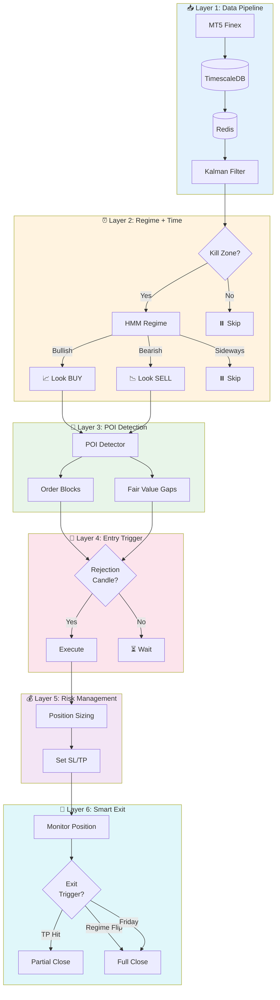
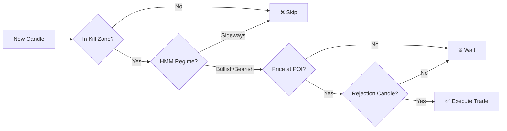

<p align="center">
  
  
  
  
</p>

<h1 align="center">🚀 SURGE-WSI</h1>
<h3 align="center">Weekly Swing Intelligence</h3>
<p align="center"><i>Quantitative Smart Money Trading System</i></p>
<p align="center"><b>Kalman + HMM + ICT = Intelligent Trading</b></p>

---

## 📋 Daftar Isi | Table of Contents

- [Tentang Proyek | About](#-tentang-proyek--about)
- [Fitur Utama | Key Features](#-fitur-utama--key-features)
- [Arsitektur | Architecture](#-arsitektur--architecture)
- [Tech Stack](#-tech-stack)
- [Struktur Proyek | Project Structure](#-struktur-proyek--project-structure)
- [Mulai Cepat | Quick Start](#-mulai-cepat--quick-start)
- [Aturan Trading | Trading Rules](#-aturan-trading--trading-rules)
- [Target Performa | Performance Targets](#-target-performa--performance-targets)
- [Dokumentasi | Documentation](#-dokumentasi--documentation)
- [Referensi | References](#-referensi--references)
- [Lisensi | License](#-lisensi--license)

---

## 📖 Tentang Proyek | About

**SURGE-WSI** (Weekly Swing Intelligence) adalah sistem trading algoritmik yang dikembangkan oleh **SURIOTA** untuk trading forex secara otomatis.

> **SURGE-WSI** (Weekly Swing Intelligence) is an algorithmic trading system developed by **SURIOTA** for automated forex trading.

### 🎯 Pendekatan Hybrid | Hybrid Approach

Sistem ini menggabungkan dua metodologi:

| Komponen | Metodologi | Fungsi |
|----------|------------|--------|
| 🔬 **Quantitative** | Kalman Filter, HMM | Noise reduction & regime detection |
| 💹 **ICT/SMC** | Order Blocks, FVG, Kill Zones | Entry zones & timing |

### 🏦 Broker

- **Nama**: Finex Indonesia (PT Finex Bisnis Solusi Futures)
- **Platform**: MetaTrader 5 (MT5)
- **Regulasi**: BAPPEBTI (AAA Rating), OJK
- **Website**: [finex.co.id](https://finex.co.id)

---

## ✨ Fitur Utama | Key Features

| Fitur | Deskripsi | Description |
|-------|-----------|-------------|
| 📊 **Kalman Filter** | Pengurangan noise untuk data harga bersih | Noise reduction for clean price data |
| 🧠 **HMM Regime** | Deteksi kondisi pasar (Bullish/Bearish/Sideways) | Market state detection |
| ⏰ **Kill Zones** | Trading hanya di sesi London/NY | Trade only during London/NY sessions |
| 🎯 **Order Blocks** | Zona entry institusional ala ICT | ICT-style institutional entry zones |
| 📐 **Fair Value Gaps** | Deteksi ketidakseimbangan harga | Price imbalance detection |
| 🚪 **Smart Exit** | Exit berbasis regime + Partial TP | Regime-based exit + Partial TP strategy |
| ⚡ **Auto Trading** | Eksekusi otomatis 24/5 | Automated execution 24/5 |
| 📱 **Telegram Alert** | Notifikasi real-time | Real-time notifications |

---

## 🏗 Arsitektur | Architecture



### 📊 Ringkasan 6 Layer | 6 Layers Summary

| # | Layer | Fungsi | Output |
|---|-------|--------|--------|
| 1️⃣ | **Data Pipeline** | Kumpul & bersihkan data | Smoothed price, velocity |
| 2️⃣ | **Regime + Time** | Kapan trading | BUY / SELL / SKIP |
| 3️⃣ | **POI Detection** | Dimana trading | List of POIs |
| 4️⃣ | **Entry Trigger** | Bagaimana masuk | Trigger confirmed |
| 5️⃣ | **Risk Management** | Berapa banyak | Lot size, SL/TP |
| 6️⃣ | **Smart Exit** | Kapan keluar | Exit action |

---

## 🛠 Tech Stack

| Komponen | Teknologi | Versi | Link |
|----------|-----------|-------|------|
| 🖥️ **Broker** | Finex Indonesia (MT5) | - | [finex.co.id](https://finex.co.id) |
| 🐍 **Language** | Python | 3.11+ | [python.org](https://python.org) |
| 🗄️ **Database** | TimescaleDB | 2.x | [timescale.com](https://timescale.com) |
| ⚡ **Cache** | Redis | 7.x | [redis.io](https://redis.io) |
| 📈 **Kalman** | filterpy | 1.4+ | [filterpy](https://filterpy.readthedocs.io) |
| 🧠 **HMM** | hmmlearn | 0.3+ | [hmmlearn](https://hmmlearn.readthedocs.io) |
| 💹 **SMC** | smartmoneyconcepts | 0.0.26 | [GitHub](https://github.com/joshyattridge/smart-money-concepts) |
| 📊 **MT5 API** | MetaTrader5 | 5.0+ | [MQL5](https://www.mql5.com/en/docs/python_metatrader5) |

---

## 📁 Struktur Proyek | Project Structure

```
SURGE-WSI/
│
├── 📄 README.md              # Dokumentasi utama (file ini)
├── 📄 CLAUDE.md              # Instruksi untuk Claude Code
├── 📄 WORKFLOW.md            # Dokumentasi workflow detail
├── 📄 requirements.txt       # Python dependencies
├── 📄 .env.example           # Template environment variables
│
├── 📁 config/
│   └── settings.yaml         # Konfigurasi sistem
│
├── 📁 src/
│   ├── 📁 data/              # Data pipeline
│   │   ├── mt5_connector.py  # Koneksi MT5
│   │   ├── db_handler.py     # Database operations
│   │   └── cache.py          # Redis cache
│   │
│   ├── 📁 analysis/          # Modul analisis
│   │   ├── kalman_filter.py  # Kalman noise reduction
│   │   ├── regime_detector.py # HMM regime detection
│   │   └── poi_detector.py   # Order Block & FVG
│   │
│   ├── 📁 trading/           # Trading logic
│   │   ├── entry_trigger.py  # Entry trigger detection
│   │   ├── risk_manager.py   # Position sizing
│   │   ├── exit_manager.py   # Exit management
│   │   └── executor.py       # Main trading loop
│   │
│   └── 📁 utils/             # Utilities
│       ├── killzone.py       # Session time checker
│       ├── logger.py         # Logging setup
│       └── telegram.py       # Telegram notifications
│
├── 📁 tests/                 # Unit tests
├── 📁 backtest/              # Backtesting scripts
└── 📁 docs/                  # Dokumentasi tambahan
```

---

## 🚀 Mulai Cepat | Quick Start

### 1️⃣ Clone Repository

```bash
git clone <repository-url>
cd SURGE-WSI
```

### 2️⃣ Install Dependencies

```bash
pip install -r requirements.txt
```

### 3️⃣ Konfigurasi | Configuration

```bash
# Copy template
cp .env.example .env
cp config/settings.example.yaml config/settings.yaml

# Edit dengan credentials Anda
nano .env
nano config/settings.yaml
```

### 4️⃣ Jalankan Backtest | Run Backtest

```bash
python -m backtest.run_backtest --symbol GBPUSD --start 2024-01-01
```

### 5️⃣ Jalankan Live Trading (Demo) | Run Live Trading (Demo)

```bash
# ⚠️ Selalu test di demo dulu!
python -m src.trading.executor --mode demo
```

---

## 📜 Aturan Trading | Trading Rules

### ✅ Kondisi Entry | Entry Conditions



| # | Kondisi | Condition |
|---|---------|-----------|
| 1 | Dalam Kill Zone (London/NY) | Within Kill Zone (London/NY) |
| 2 | HMM Regime = BULLISH (BUY) atau BEARISH (SELL) | HMM Regime = BULLISH (BUY) or BEARISH (SELL) |
| 3 | Harga di POI valid (Order Block / FVG) | Price at valid POI (Order Block / FVG) |
| 4 | Konfirmasi rejection candle (wick > 50%) | Rejection candle confirmation (wick > 50%) |

### 🚪 Kondisi Exit | Exit Conditions

| # | Trigger | Aksi | Action |
|---|---------|------|--------|
| 1 | TP1 hit (RR 1:1.5) | Close 50%, SL → Breakeven | Close 50%, SL → Breakeven |
| 2 | TP2 hit (RR 1:2.5) | Close 30% | Close 30% |
| 3 | TP3 / Trailing | Close sisa 20% | Close remaining 20% |
| 4 | Regime flip | Exit semua | Exit all |
| 5 | Jumat 20:00 UTC | Force close | Force close |

### 💰 Risk Management

| Parameter | Nilai | Value |
|-----------|-------|-------|
| Base risk per trade | 1% | 1% |
| High quality POI | 1.5% | 1.5% |
| Max SL (H4/H1 zones) | 50 pips | 50 pips |
| Max SL (M15 zones) | 30 pips | 30 pips |
| Max open positions | 3 | 3 |
| Max daily risk | 3% | 3% |

---

## 📈 Target Performa | Performance Targets

| Metrik | Target | Minimum |
|--------|--------|---------|
| 🎯 Win Rate | 55-65% | > 50% |
| 📊 Average RR | 1:2 | > 1:1.5 |
| 💹 Profit Factor | > 1.5 | > 1.2 |
| 📉 Max Drawdown | < 10% | < 15% |
| 💰 Monthly Return | 5-15% | > 3% |
| 🔢 Trades/Week | 3-8 | 2-10 |

---

## 📚 Dokumentasi | Documentation

| Dokumen | Deskripsi | Description |
|---------|-----------|-------------|
| 📄 [README.md](README.md) | Overview proyek (file ini) | Project overview (this file) |
| 📄 [CLAUDE.md](CLAUDE.md) | Instruksi untuk Claude Code | Instructions for Claude Code |
| 📄 [WORKFLOW.md](WORKFLOW.md) | Workflow detail dengan diagram | Detailed workflow with diagrams |

---

## 🔗 Referensi | References

### 📊 Quantitative Trading

- [Kalman Filter Python Tutorial - QuantInsti](https://blog.quantinsti.com/kalman-filter/)
- [HMM Regime Detection - QuantStart](https://www.quantstart.com/articles/market-regime-detection-using-hidden-markov-models-in-qstrader/)
- [filterpy Documentation](https://filterpy.readthedocs.io/)
- [hmmlearn Documentation](https://hmmlearn.readthedocs.io/)

### 💹 ICT / SMC Concepts

- [Smart Money Concepts Python - GitHub](https://github.com/joshyattridge/smart-money-concepts)
- [ICT Trading Guide - XS](https://www.xs.com/en/blog/ict-trading/)
- [Order Blocks Guide - XS](https://www.xs.com/en/blog/order-block-guide/)
- [Fair Value Gap Guide - XS](https://www.xs.com/en/blog/fair-value-gap/)
- [ICT Kill Zones - HowToTrade](https://howtotrade.com/blog/ict-kill-zones/)

### 🖥️ MetaTrader 5

- [MT5 Python Documentation - MQL5](https://www.mql5.com/en/docs/python_metatrader5)
- [Finex MT5 Platform](https://finex.co.id/trading/platform-web-mt5)

---

## ⚠️ Disclaimer

> **Bahasa Indonesia:**
> Ini adalah tools trading internal untuk SURIOTA. Tidak untuk distribusi eksternal.
> Selalu test di akun demo sebelum live trading.
> Performa masa lalu tidak menjamin hasil di masa depan.
> Trading forex memiliki risiko tinggi. Gunakan dengan bijak.

> **English:**
> This is an internal trading tool for SURIOTA. Not for external distribution.
> Always test on demo account before live trading.
> Past performance does not guarantee future results.
> Forex trading carries high risk. Use wisely.

---

## 📜 Lisensi | License

```
Copyright (c) 2026 SURIOTA

Proprietary License - Internal Use Only
All rights reserved.

This software and documentation are confidential and proprietary
to SURIOTA. Unauthorized copying, distribution, or use is strictly prohibited.
```

---

<p align="center">
  <b>SURGE-WSI</b><br>
  <i>"Smart Entry, Intelligent Exit, Consistent Profits"</i>
</p>

<p align="center">
  Dibuat dengan ❤️ oleh <b>Gifari K Suryo</b> - SURIOTA<br>
  Dengan bantuan 🤖 <b>Claude AI (Anthropic)</b>
</p>

<p align="center">
  
  
  
</p>
