# WORKFLOW.md - Dokumentasi Workflow SURGE-WSI | SURGE-WSI Workflow Documentation

<p align="center">
  
  
</p>

<p align="center">
  <b>"Kalman + HMM + ICT = Quantitative Smart Money"</b>
</p>

---

## 📋 Daftar Isi | Table of Contents

- [Overview Arsitektur | Architecture Overview](#-overview-arsitektur--architecture-overview)
- [Layer 1: Data Pipeline](#-layer-1-data-pipeline)
- [Layer 2: Regime + Time Filter](#-layer-2-regime--time-filter)
- [Layer 3: POI Detection](#-layer-3-poi-detection)
- [Layer 4: Entry Trigger](#-layer-4-entry-trigger)
- [Layer 5: Risk Management](#-layer-5-risk-management)
- [Layer 6: Smart Exit](#-layer-6-smart-exit)
- [Alur Sinyal | Signal Flow](#-alur-sinyal--signal-flow)
- [Konfigurasi | Configuration](#-konfigurasi--configuration)
- [Metrik Performa | Performance Metrics](#-metrik-performa--performance-metrics)
- [Changelog](#-changelog)

---

## 🏗 Overview Arsitektur | Architecture Overview

### Diagram Arsitektur 6 Layer | 6 Layer Architecture Diagram

```mermaid
flowchart TB
    subgraph Layer1["📥 LAYER 1: DATA PIPELINE"]
        direction LR
        MT5["🖥️ MT5<br/>Finex"] --> TSDB["🗄️ TimescaleDB<br/>Storage"]
        TSDB --> REDIS["⚡ Redis<br/>Cache"]
        REDIS --> KALMAN["📈 Kalman Filter<br/>Noise Reduction"]
    end

    subgraph Layer2["⏰ LAYER 2: REGIME + TIME FILTER"]
        direction LR
        KALMAN --> KZ{"Kill Zone?"}
        KZ -->|"✓ Yes"| HMM["🧠 HMM Regime"]
        KZ -->|"✗ No"| SKIP1["⏸️ Skip"]
        HMM -->|"🟢 Bullish"| BUY["📈 Look BUY"]
        HMM -->|"🔴 Bearish"| SELL["📉 Look SELL"]
        HMM -->|"⚪ Sideways"| SKIP2["⏸️ Skip"]
    end

    subgraph Layer3["🎯 LAYER 3: POI DETECTION"]
        direction LR
        BUY --> POI["🎯 POI Detector"]
        SELL --> POI
        POI --> OB["📦 Order Blocks"]
        POI --> FVG["📐 Fair Value Gaps"]
    end

    subgraph Layer4["🔔 LAYER 4: ENTRY TRIGGER"]
        OB --> TRIGGER{"Rejection<br/>Candle?"}
        FVG --> TRIGGER
        TRIGGER -->|"✓ Yes"| EXEC["✅ Execute"]
        TRIGGER -->|"✗ No"| WAIT["⏳ Wait"]
    end

    subgraph Layer5["💰 LAYER 5: RISK MANAGEMENT"]
        EXEC --> RISK["📊 Position Sizing"]
        RISK --> SLTP["🎯 Set SL/TP"]
    end

    subgraph Layer6["🚪 LAYER 6: SMART EXIT"]
        SLTP --> MONITOR["👁️ Monitor"]
        MONITOR --> EXIT{"Exit<br/>Trigger?"}
        EXIT -->|"TP Hit"| PARTIAL["📈 Partial Close"]
        EXIT -->|"Regime Flip"| FULL1["🔄 Full Close"]
        EXIT -->|"Friday"| FULL2["📅 Full Close"]
    end

    style Layer1 fill:#e3f2fd
    style Layer2 fill:#fff3e0
    style Layer3 fill:#e8f5e9
    style Layer4 fill:#fce4ec
    style Layer5 fill:#f3e5f5
    style Layer6 fill:#e0f7fa
```

### Ringkasan 6 Layer | 6 Layers Summary

| # | Layer | Pertanyaan | Output |
|---|-------|------------|--------|
| 1️⃣ | **Data Pipeline** | - | Clean price data (smoothed, velocity) |
| 2️⃣ | **Regime + Time** | KAPAN trading? / WHEN to trade? | BUY / SELL / SKIP |
| 3️⃣ | **POI Detection** | DIMANA trading? / WHERE to trade? | List of POIs |
| 4️⃣ | **Entry Trigger** | BAGAIMANA masuk? / HOW to enter? | Trigger confirmed |
| 5️⃣ | **Risk Management** | BERAPA banyak? / HOW MUCH? | Lot size, SL/TP |
| 6️⃣ | **Smart Exit** | KAPAN keluar? / WHEN to exit? | Exit action |

---

## 📥 Layer 1: Data Pipeline

### Tujuan | Purpose

Mengumpulkan data harga dari MT5, menyimpan di database, dan membersihkan noise menggunakan Kalman Filter.

> Collect price data from MT5, store in database, and clean noise using Kalman Filter.

### Komponen | Components

```mermaid
flowchart LR
    MT5["🖥️ MT5 Finex<br/>Raw Data"]
    TSDB["🗄️ TimescaleDB<br/>Time-series Storage"]
    REDIS["⚡ Redis<br/>Real-time Cache"]
    KALMAN["📈 Kalman Filter<br/>State: [price, velocity, accel]"]

    MT5 -->|"OHLCV"| TSDB
    TSDB -->|"Query"| REDIS
    REDIS -->|"Feed"| KALMAN

    subgraph Output["📤 Output"]
        SP["Smoothed Price"]
        VEL["Velocity"]
        ACC["Acceleration"]
    end

    KALMAN --> Output
```

### Timeframe yang Dikumpulkan | Collected Timeframes

| Timeframe | Fungsi | Function |
|-----------|--------|----------|
| 📊 **D1** (Daily) | Konteks trend | Trend context |
| 📊 **H4** (4-Hour) | Struktur swing | Swing structure |
| 📊 **H1** (1-Hour) | Signal utama | Primary signal |
| 📊 **M15** (15-Min) | Refinement entry | Entry refinement |

### Konfigurasi Kalman Filter | Kalman Filter Configuration

```python
# Single Kalman Filter (bukan 3x - sudah disederhanakan)
# Single Kalman Filter (not 3x - simplified)
kalman_config = {
    'process_noise': 0.01,      # Q - seberapa percaya model | trust in model
    'measurement_noise': 0.1,   # R - noise dari measurements
    'state_dimension': 3,       # [price, velocity, acceleration]
}
```

### Output Data Structure

```python
@dataclass
class KalmanState:
    raw_price: float        # Harga asli | Original price
    smoothed_price: float   # Harga bersih | Noise-reduced price
    velocity: float         # Kecepatan perubahan | Rate of change
    acceleration: float     # Perubahan velocity | Change of velocity
```

---

## ⏰ Layer 2: Regime + Time Filter

### Tujuan | Purpose

Menentukan **KAPAN** trading berdasarkan:
1. Waktu (Kill Zones)
2. Kondisi pasar (Bullish/Bearish/Sideways)

> Determine **WHEN** to trade based on:
> 1. Time of day (Kill Zones)
> 2. Market regime (Bullish/Bearish/Sideways)

### Kill Zones (UTC)

```mermaid
gantt
    title 📅 Kill Zones - Trading Hours (UTC)
    dateFormat HH:mm
    axisFormat %H:%M

    section 🇬🇧 London
    London Open (07:00-10:00)       :active, london, 07:00, 3h

    section 🇺🇸 New York
    New York Open (12:00-15:00)     :active, ny, 12:00, 3h

    section 🔥 Best
    Overlap Session (12:00-16:00)   :crit, overlap, 12:00, 4h

    section ⚠️ Risk
    Friday Close Risk (18:00+)      :done, friday, 18:00, 6h
```

| Zona | Waktu UTC | Waktu WIB | Keterangan |
|------|-----------|-----------|------------|
| 🇬🇧 **London** | 07:00 - 10:00 | 14:00 - 17:00 | Volatilitas tinggi |
| 🇺🇸 **New York** | 12:00 - 15:00 | 19:00 - 22:00 | Volatilitas tinggi |
| 🔥 **Overlap** | 12:00 - 16:00 | 19:00 - 23:00 | Peluang terbaik |
| ⚠️ **Friday Close** | Setelah 18:00 | Setelah 01:00 | Stop new entries |

### HMM Regime Detection

```mermaid
stateDiagram-v2
    [*] --> Analyzing

    state Analyzing {
        [*] --> CheckVelocity
        CheckVelocity --> Bullish : velocity > 0 AND confidence > 60%
        CheckVelocity --> Bearish : velocity < 0 AND confidence > 60%
        CheckVelocity --> Sideways : |velocity| < threshold OR confidence < 50%
    }

    Bullish --> [*] : Output: Look BUY
    Bearish --> [*] : Output: Look SELL
    Sideways --> [*] : Output: SKIP

    note right of Bullish : 🟢 Trade Direction: BUY
    note right of Bearish : 🔴 Trade Direction: SELL
    note right of Sideways : ⚪ NO TRADE
```

| State | Kondisi | Action |
|-------|---------|--------|
| 🟢 **BULLISH** | velocity > 0, confidence > 60% | Look for BUY setups |
| 🔴 **BEARISH** | velocity < 0, confidence > 60% | Look for SELL setups |
| ⚪ **SIDEWAYS** | \|velocity\| < threshold | NO TRADE |

### Combined Filter Logic

```python
def should_trade(current_time, kalman_state, hmm_regime):
    """
    Cek apakah kondisi memenuhi syarat trading.
    Check if conditions are met for trading.
    """

    # Step 1: Kill Zone Check
    if not is_kill_zone(current_time):
        return False, "Outside kill zone"

    # Step 2: Friday Check
    if is_friday_after_18utc(current_time):
        return False, "Friday close approaching"

    # Step 3: Regime Check
    if hmm_regime.state == "SIDEWAYS":
        return False, "Sideways regime - no clear direction"

    if hmm_regime.confidence < 0.6:
        return False, "Low regime confidence"

    # All checks passed ✅
    trade_bias = "BUY" if hmm_regime.state == "BULLISH" else "SELL"
    return True, trade_bias
```

---

## 🎯 Layer 3: POI Detection

### Tujuan | Purpose

Mengidentifikasi **DIMANA** trading menggunakan konsep ICT/SMC.

> Identify **WHERE** to trade using ICT/SMC concepts.

### Tipe POI | POI Types

#### 📦 Order Blocks (Primary Entry Zones)

```mermaid
flowchart TB
    subgraph Bullish["🟢 Bullish Order Block"]
        direction TB
        B1["📉 Last RED candle"]
        B2["📈 Strong UP move"]
        B3["✨ Demand Zone"]
        B1 --> B2
        B2 --> B3
    end

    subgraph Bearish["🔴 Bearish Order Block"]
        direction TB
        S1["📈 Last GREEN candle"]
        S2["📉 Strong DOWN move"]
        S3["✨ Supply Zone"]
        S1 --> S2
        S2 --> S3
    end
```

| Tipe | Deskripsi | Description |
|------|-----------|-------------|
| 🟢 **Bullish OB** | Candle MERAH terakhir sebelum naik kuat | Last RED candle before strong UP move |
| 🔴 **Bearish OB** | Candle HIJAU terakhir sebelum turun kuat | Last GREEN candle before strong DOWN move |

#### 📐 Fair Value Gaps (Confluence Bonus)

```mermaid
flowchart LR
    subgraph BullFVG["🟢 Bullish FVG"]
        C1B["Candle 1<br/>Low"] -.->|"GAP"| C3B["Candle 3<br/>High"]
        C2B["Candle 2<br/>Impulse"]
    end

    subgraph BearFVG["🔴 Bearish FVG"]
        C1S["Candle 1<br/>High"] -.->|"GAP"| C3S["Candle 3<br/>Low"]
        C2S["Candle 2<br/>Impulse"]
    end
```

> **GAP** = Tidak ada overlap antara Candle 1 dan Candle 3. Harga cenderung kembali untuk mengisi gap ini.
>
> **GAP** = No overlap between Candle 1 and Candle 3. Price tends to return and fill this gap.

### Multi-Timeframe Analysis

```mermaid
flowchart TB
    subgraph TF["📊 Timeframe Hierarchy"]
        H4["📊 H4<br/>Major Zones<br/>50-100 pips<br/>Weight: 1.0<br/>Risk: 1.5%"]
        H1["📊 H1<br/>Swing Zones<br/>20-50 pips<br/>Weight: 0.7<br/>Risk: 1.0%"]
        M15["📊 M15<br/>Hidden Zones<br/>10-20 pips<br/>Weight: 0.5<br/>Risk: 0.5%"]
    end

    H4 --> H1 --> M15

    style H4 fill:#4caf50,color:#fff
    style H1 fill:#2196f3,color:#fff
    style M15 fill:#ff9800,color:#fff
```

| Timeframe | Tipe Zone | Ukuran | Weight | Risk |
|-----------|-----------|--------|--------|------|
| 📊 **H4** | Major Zones | 50-100 pips | 1.0 | 1.5% |
| 📊 **H1** | Swing Zones | 20-50 pips | 0.7 | 1.0% |
| 📊 **M15** | Hidden Zones | 10-20 pips | 0.5 | 0.5% |

### Quality Score Calculation

```python
def calculate_poi_quality(poi) -> float:
    """
    Formula Quality Score (0-100):

    Score = TF_weight(40) + Freshness(30) + Impulse(20) + FVG_confluence(10)
    """

    # Timeframe weight (40 points max)
    tf_weights = {'H4': 1.0, 'H1': 0.7, 'M15': 0.5}
    tf_score = tf_weights.get(poi.timeframe, 0.5) * 40

    # Freshness - never touched = fresh (30 points max)
    freshness_map = {0: 30, 1: 20}  # touch_count: score
    freshness_score = freshness_map.get(poi.touch_count, 10)

    # Impulse strength (20 points max)
    impulse_score = min(poi.impulse_strength * 10, 20)

    # FVG confluence (10 points bonus)
    fvg_score = 10 if poi.has_fvg_confluence else 0

    return tf_score + freshness_score + impulse_score + fvg_score
```

### POI Data Structure

```python
@dataclass
class POI:
    poi_type: str           # 'order_block' | 'fvg'
    direction: str          # 'bullish' | 'bearish'
    zone_high: float        # Batas atas | Upper boundary
    zone_low: float         # Batas bawah | Lower boundary
    zone_mid: float         # Titik tengah | Midpoint (entry level)
    timeframe: str          # 'H4' | 'H1' | 'M15'
    quality_score: float    # 0-100
    is_fresh: bool          # Belum pernah disentuh | Never touched
    is_mitigated: bool      # Sudah ditembus | Fully breached (invalid)
    has_fvg_confluence: bool
    created_at: datetime
```

---

## 🔔 Layer 4: Entry Trigger

### Tujuan | Purpose

Menentukan momen tepat untuk masuk setelah harga mencapai POI.

> Determine the precise moment to enter after price reaches a POI.

### Rejection Candle Detection

```mermaid
flowchart TB
    subgraph BullReject["🟢 Bullish Rejection"]
        BR1["📊 At Demand Zone"]
        BR2["Lower wick > 50%"]
        BR3["Close in upper portion"]
        BR4["✅ BUY Signal"]
        BR1 --> BR2 --> BR3 --> BR4
    end

    subgraph BearReject["🔴 Bearish Rejection"]
        SR1["📊 At Supply Zone"]
        SR2["Upper wick > 50%"]
        SR3["Close in lower portion"]
        SR4["✅ SELL Signal"]
        SR1 --> SR2 --> SR3 --> SR4
    end
```

| Tipe | Kondisi | Meaning |
|------|---------|---------|
| 🟢 **Bullish Rejection** | Lower wick > 50% total range | Buyer rejected lower prices |
| 🔴 **Bearish Rejection** | Upper wick > 50% total range | Seller rejected higher prices |

### Trigger Logic

```python
def check_entry_trigger(candle, poi, trade_bias) -> tuple:
    """
    Cek apakah candle memberikan trigger entry valid.
    Check if current candle provides valid entry trigger.

    Returns:
        (trigger_valid: bool, pattern_type: str)
    """

    body = abs(candle.close - candle.open)
    total_range = candle.high - candle.low

    if total_range == 0:
        return False, None

    upper_wick = candle.high - max(candle.open, candle.close)
    lower_wick = min(candle.open, candle.close) - candle.low

    wick_ratio_threshold = 0.5  # 50%

    if trade_bias == 'BUY':
        # Looking for bullish rejection
        lower_wick_ratio = lower_wick / total_range
        if lower_wick_ratio >= wick_ratio_threshold:
            return True, 'bullish_rejection'

    elif trade_bias == 'SELL':
        # Looking for bearish rejection
        upper_wick_ratio = upper_wick / total_range
        if upper_wick_ratio >= wick_ratio_threshold:
            return True, 'bearish_rejection'

    return False, None
```

---

## 💰 Layer 5: Risk Management

### Tujuan | Purpose

Menghitung ukuran posisi dan menentukan level SL/TP.

> Calculate position size and define SL/TP levels.

### Position Sizing

```mermaid
flowchart TB
    subgraph Input["📥 Input"]
        BAL["💰 Balance"]
        RISK["📊 Risk %"]
        SL["🛑 SL Pips"]
        PIP["💵 Pip Value"]
    end

    subgraph Formula["📐 Formula"]
        CALC["lot_size = (balance × risk%) / (SL × pip_value)"]
    end

    subgraph Output["📤 Output"]
        LOT["📊 Lot Size"]
    end

    Input --> Formula --> Output
```

| POI Quality | Risk % | Kondisi |
|-------------|--------|---------|
| 🌟 **High (>80)** | 1.5% | H4 zone + fresh + FVG |
| ⭐ **Medium (60-80)** | 1.0% | H1 zone + fresh |
| ✨ **Low (<60)** | 0.5% | M15 zone (hidden) |

### Contoh Perhitungan | Calculation Example

```
Balance     = $10,000
Risk        = 1% = $100
SL          = 30 pips
Pip value   = $10/lot (standard lot GBPUSD)

lot_size    = $100 / (30 × $10) = 0.33 lots
```

### Portfolio Limits

| Limit | Nilai | Value |
|-------|-------|-------|
| Max open positions | 3 | 3 |
| Max daily risk | 3% | 3% |
| Max weekly risk | 6% | 6% |

### Stop Loss Placement

```mermaid
flowchart LR
    subgraph BuySL["🟢 BUY Trade"]
        BE1["Entry"] --> BSL["SL = POI.zone_low - (ATR × 0.3)"]
    end

    subgraph SellSL["🔴 SELL Trade"]
        SE1["Entry"] --> SSL["SL = POI.zone_high + (ATR × 0.3)"]
    end
```

| Zone Type | Max SL |
|-----------|--------|
| H4 zones | 50 pips |
| H1 zones | 40 pips |
| M15 zones | 30 pips |

> ⚠️ Jika SL melebihi max, **SKIP** trade tersebut.
>
> ⚠️ If calculated SL exceeds max, **SKIP** the trade.

### Take Profit Strategy (Partial Close)

```mermaid
flowchart TB
    subgraph TP["📈 Take Profit Strategy"]
        ENTRY["🎯 Entry"]
        TP1["TP1 (RR 1:1.5)<br/>Close 50%<br/>SL → Breakeven"]
        TP2["TP2 (RR 1:2.5)<br/>Close 30%<br/>Keep Trailing"]
        TP3["TP3 (Trailing)<br/>Close 20%<br/>Let it Run"]

        ENTRY --> TP1 --> TP2 --> TP3
    end

    style ENTRY fill:#2196f3,color:#fff
    style TP1 fill:#4caf50,color:#fff
    style TP2 fill:#8bc34a,color:#fff
    style TP3 fill:#cddc39,color:#000
```

| Level | RR Ratio | Close % | Action After |
|-------|----------|---------|--------------|
| 🎯 **TP1** | 1:1.5 | 50% | Move SL to breakeven |
| 🎯 **TP2** | 1:2.5 | 30% | Continue trailing |
| 🎯 **TP3** | Trailing | 20% | Let it run |

---

## 🚪 Layer 6: Smart Exit

### Tujuan | Purpose

Mengelola posisi terbuka dan menentukan kapan harus keluar.

> Manage open positions and determine when to exit.

### Exit Triggers (Priority Order)

```mermaid
flowchart TB
    subgraph Priority["🚪 Exit Priority"]
        P1["🛑 PRIORITY 1<br/>Stop Loss Hit<br/>Immediate Exit"]
        P2["🎯 PRIORITY 2<br/>Take Profit Hit<br/>Partial Close"]
        P3["🔄 PRIORITY 3<br/>Regime Flip<br/>Full Close"]
        P4["📅 PRIORITY 4<br/>Friday 20:00 UTC<br/>Full Close"]
    end

    P1 --> P2 --> P3 --> P4

    style P1 fill:#f44336,color:#fff
    style P2 fill:#4caf50,color:#fff
    style P3 fill:#ff9800,color:#fff
    style P4 fill:#9c27b0,color:#fff
```

| Priority | Trigger | Action |
|----------|---------|--------|
| 1️⃣ | **Stop Loss Hit** | Exit segera, terima loss |
| 2️⃣ | **Take Profit Hit** | Partial close sesuai level |
| 3️⃣ | **Regime Flip** | Close semua posisi searah |
| 4️⃣ | **Friday Close** | Close semua (avoid weekend gap) |

### Exit Logic Implementation

```python
def check_exit_conditions(position, current_state) -> tuple:
    """
    Cek semua kondisi exit untuk posisi terbuka.
    Check all exit conditions for an open position.

    Returns:
        (should_exit: bool, exit_type: str, close_percent: float)
    """

    # Priority 1: SL Hit
    if position.is_sl_hit(current_state.price):
        return True, 'stop_loss', 100

    # Priority 2: TP Hit
    if position.is_tp1_hit(current_state.price) and not position.tp1_closed:
        return True, 'take_profit_1', 50

    if position.is_tp2_hit(current_state.price) and not position.tp2_closed:
        return True, 'take_profit_2', 30

    if position.is_tp3_hit(current_state.price):
        return True, 'take_profit_3', 100  # Close remaining

    # Priority 3: Regime Flip
    if is_regime_flipped(position.direction, current_state.regime):
        return True, 'regime_flip', 100

    # Priority 4: Friday Close
    if is_friday_close_time(current_state.time):
        return True, 'friday_close', 100

    return False, None, 0
```

---

## 🔄 Alur Sinyal | Signal Flow

### Complete Decision Flow

```mermaid
flowchart TB
    START["🕐 START<br/>(H1 Candle Close)"]

    KZ{"⏰ In Kill Zone?<br/>(London/NY/Overlap)"}
    REGIME{"🧠 HMM Regime?"}
    POI_CHECK{"🎯 Price at POI?"}
    TRIGGER{"🔔 Rejection Candle?<br/>(wick > 50%)"}

    SKIP1["⏸️ SKIP<br/>Outside session"]
    SKIP2["⏸️ SKIP<br/>Sideways regime"]
    WAIT1["⏳ WAIT<br/>for price at zone"]
    WAIT2["⏳ WAIT<br/>for trigger"]

    BULLISH["🟢 BULLISH<br/>bias = BUY"]
    BEARISH["🔴 BEARISH<br/>bias = SELL"]

    FIND_POI["🔍 Find Valid POIs<br/>(aligned with bias)"]

    EXECUTE["✅ EXECUTE TRADE<br/>1. Calculate lot<br/>2. Set SL/TP<br/>3. Place order<br/>4. Alert"]

    START --> KZ
    KZ -->|"No"| SKIP1
    KZ -->|"Yes"| REGIME

    REGIME -->|"Bullish"| BULLISH
    REGIME -->|"Bearish"| BEARISH
    REGIME -->|"Sideways"| SKIP2

    BULLISH --> FIND_POI
    BEARISH --> FIND_POI

    FIND_POI -->|"None"| WAIT1
    FIND_POI -->|"Found"| POI_CHECK

    POI_CHECK -->|"No"| WAIT1
    POI_CHECK -->|"Yes"| TRIGGER

    TRIGGER -->|"No"| WAIT2
    TRIGGER -->|"Yes"| EXECUTE

    style START fill:#2196f3,color:#fff
    style EXECUTE fill:#4caf50,color:#fff
    style SKIP1 fill:#9e9e9e,color:#fff
    style SKIP2 fill:#9e9e9e,color:#fff
    style WAIT1 fill:#ff9800,color:#fff
    style WAIT2 fill:#ff9800,color:#fff
    style BULLISH fill:#4caf50,color:#fff
    style BEARISH fill:#f44336,color:#fff
```

---

## ⚙️ Konfigurasi | Configuration

### settings.yaml

```yaml
# =============================================================================
# SURGE-WSI Configuration
# =============================================================================

# Broker
broker:
  name: "Finex"
  server: "Finex-Demo"  # Ganti ke Finex-Live untuk production
  symbols:
    - "GBPUSD"
    - "EURUSD"

# Kill Zones (UTC)
kill_zones:
  london:
    start: "07:00"
    end: "10:00"
  new_york:
    start: "12:00"
    end: "15:00"
  overlap:
    start: "12:00"
    end: "16:00"
  friday_close: "18:00"  # Tidak ada entry baru setelah ini

# Kalman Filter
kalman:
  process_noise: 0.01
  measurement_noise: 0.1

# HMM Regime
hmm:
  n_states: 3  # Bullish, Bearish, Sideways
  min_confidence: 0.6
  velocity_threshold: 0.0001

# POI Detection
poi:
  timeframes:
    - "H4"
    - "H1"
    - "M15"
  min_quality_score: 60
  max_zones_per_tf: 5

# Entry Trigger
entry:
  rejection_wick_ratio: 0.5  # 50%

# Risk Management
risk:
  base_risk_percent: 1.0
  high_quality_risk: 1.5
  low_quality_risk: 0.5
  max_sl_pips:
    H4: 50
    H1: 40
    M15: 30
  max_open_positions: 3
  max_daily_risk: 3.0
  max_weekly_risk: 6.0

# Take Profit
take_profit:
  tp1_rr: 1.5
  tp1_close_percent: 50
  tp2_rr: 2.5
  tp2_close_percent: 30
  tp3_type: "trailing"
  tp3_close_percent: 20
  trailing_atr_multiplier: 1.0

# Alerts
alerts:
  telegram:
    enabled: true
    send_signals: true
    send_trades: true
    send_daily_summary: true
```

---

## 📊 Metrik Performa | Performance Metrics

### Target Performance

| Metrik | Target | Minimum Acceptable |
|--------|--------|-------------------|
| 🎯 **Win Rate** | 55-65% | > 50% |
| 📊 **Average RR** | 1:2 | > 1:1.5 |
| 💹 **Profit Factor** | > 1.5 | > 1.2 |
| 📉 **Max Drawdown** | < 10% | < 15% |
| 💰 **Monthly Return** | 5-15% | > 3% |
| 🔢 **Trades/Week** | 3-8 | 2-10 |

### Tracking Metrics

```python
@dataclass
class PerformanceMetrics:
    # Basic Stats
    total_trades: int
    winning_trades: int
    losing_trades: int
    win_rate: float

    # PnL
    total_pnl: float
    gross_profit: float
    gross_loss: float
    profit_factor: float

    # Averages
    average_win: float
    average_loss: float
    average_rr: float

    # Risk
    max_drawdown: float
    max_consecutive_losses: int

    # Breakdown
    trades_by_regime: dict      # {'BULLISH': 10, 'BEARISH': 5}
    trades_by_poi_type: dict    # {'order_block': 12, 'fvg': 3}
    trades_by_session: dict     # {'london': 7, 'ny': 5, 'overlap': 3}
```

---

## 📝 Changelog

### v3.0 (Current - Final)

| Perubahan | Description |
|-----------|-------------|
| ✅ Simplified architecture | Dari 10+ komponen menjadi 6 core layers |
| ✅ Single Kalman | Removed redundant 3x Kalman filter |
| ✅ Unified POI | Merged OB + FVG detection |
| ✅ Removed liquidity layer | Integrated into POI detection |
| ✅ Added Kill Zones | ICT session-based trading |
| ✅ Partial TP | Implemented 50/30/20 strategy |

### v2.0

- Added hidden zones (M15)
- Multi-TF zone detection
- BOS/ChoCH structure analysis

### v1.0

- Initial concept
- Basic Kalman + HMM
- Simple S/D zones

---

## 🔗 Referensi | References

### Quantitative Trading

- [Kalman Filter Python - QuantInsti](https://blog.quantinsti.com/kalman-filter/)
- [HMM Regime Detection - QuantStart](https://www.quantstart.com/articles/market-regime-detection-using-hidden-markov-models-in-qstrader/)
- [filterpy Documentation](https://filterpy.readthedocs.io/)
- [hmmlearn Documentation](https://hmmlearn.readthedocs.io/)

### ICT / SMC

- [Smart Money Concepts - GitHub](https://github.com/joshyattridge/smart-money-concepts)
- [ICT Trading Guide](https://www.xs.com/en/blog/ict-trading/)
- [Order Blocks Guide](https://www.xs.com/en/blog/order-block-guide/)
- [Fair Value Gap Guide](https://www.xs.com/en/blog/fair-value-gap/)

---

<p align="center">
  <b>SURGE-WSI v3.0</b><br>
  <i>"Smart Entry, Intelligent Exit, Consistent Profits"</i>
</p>

<p align="center">
  Dibuat oleh <b>Gifari K Suryo</b> - SURIOTA<br>
  Dengan bantuan 🤖 <b>Claude AI (Anthropic)</b>
</p>

<p align="center">
  <sub>Copyright (c) 2026 SURIOTA - All Rights Reserved</sub>
</p>
